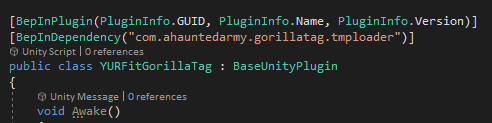

# TMPLoader
very simple, very basic mod to load the default settings for TextMeshPro and initializes it so asset bundles can use TextMeshPro in Gorilla Tag.

i reccomend adding this as a dependency to your mod if you intend to use TextMeshPro as shown below. For more information on dependencies check out the [BepInEx documentation](https://docs.bepinex.dev/master/articles/dev_guide/plugin_tutorial/2_plugin_start.html?tabs=tabid-unitymono).

